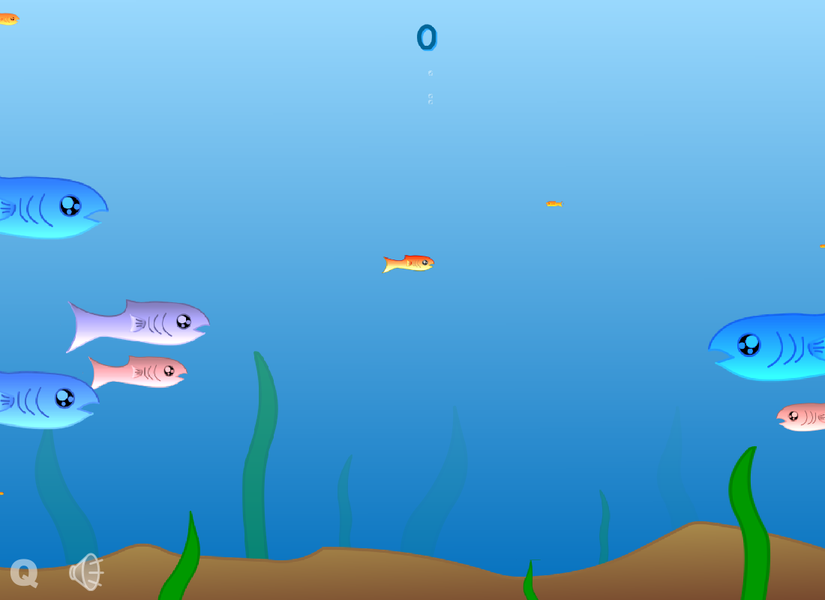
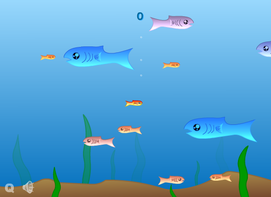
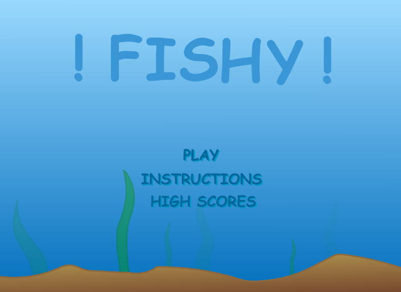
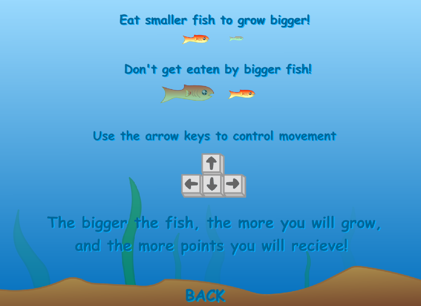
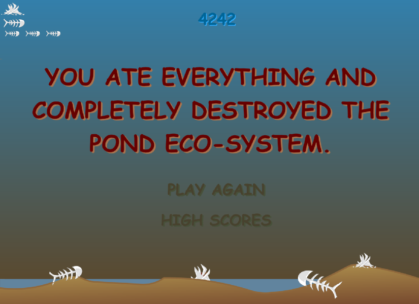

# Fishy

An Android remake of **Fishy**, the Flash game XGen Studios released in 2003.
You play a small fish in a pond. Eat fish smaller than you to grow, and stay
away from fish bigger than you. **No ads, no in-app purchases, no analytics.**

  

## Download

**Direct APK download:**
https://github.com/Matswm86/fishy/releases/download/latest/fishy.apk

1. Open that link in your phone's browser and download the file.
2. Open the downloaded file. Android may say *"For your security, your phone
   is not allowed to install unknown apps from this source."* Tap
   **Settings**, turn on **Allow from this source**, go back and install.
3. The app appears as **Fishy**. It runs in landscape.

The APK is debug-signed with a fixed key, so a newer build installs over an
older one. Versioned builds also go to the
[Releases page](https://github.com/Matswm86/fishy/releases) when a `vX.Y.Z`
tag is pushed.

## How close is it to the original?

The graphics, sounds, music and rules all come from the original Flash file
(`Fishy.swf`, preserved on [archive.org](https://archive.org/details/fishygame)).

- **Music.** The in-game loop is the original `_koi.wav` track. The Flash
  file played it 10,000 times in a row when you pressed PLAY; here it loops
  the same way. The splash, eat ("burp"), sploosh and XGen intro sounds are
  also the originals.
- **Graphics.** Every fish, plant, bone, button and title letter was exported
  from the SWF's vector art and rendered at 1.5 to 4 times the original size,
  so it stays sharp on phone screens. Each screen is placed at its original
  coordinates on the original 550 x 400 stage.
- **Rules.** The game logic is a line-by-line port of the original
  ActionScript. It runs at the original 30 frames per second. Fish sizes,
  speeds and colours are random in the same ranges. You grow by 1/50 of each
  fish you eat, you score 6 points per unit of its size, and you win when you
  pass size 300.

What changed for phones:

- **Controls.** Put a finger anywhere on the screen and drag, like a
  joystick. Dragging left, right, up or down counts as holding that arrow key,
  so the fish accelerates exactly like the keyboard version. Arrow keys still
  work on a keyboard.
- **Easier start.** In the original only 13 of the 72 possible fish sizes
  were smaller than your starting fish. Here, while you are small, up to 60%
  of new fish are forced to spawn smaller than you and the rest are rolled as
  before. That help fades out as you grow and is gone at size 60, from where
  the original size roll applies unchanged.
- **High scores.** XGen's online high-score server is gone, so the top 10
  scores are saved on the phone.
- **Wide screens.** The pond is mirrored into the extra width at the sides.
  Fish still only swim inside the original stage.

  
   <em>The original Flash version (2003), for comparison.</em>

## Screens

| Title | Instructions | Game over, pond emptied |
|---|---|---|
|  |  |  |

## Building

The APK is built by GitHub Actions (`.github/workflows/build-android.yml`)
with Godot 4.6.2 on every push to `main`. To run it on a desktop, open the
folder in Godot 4.6 and press Play.

`tools/bake_assets.py` rebuilds the sprite sheets in `assets/gfx/` from a
[JPEXS FFDec](https://github.com/jindrapetrik/jpexs-decompiler) export of
the original SWF.

## Credits

Fishy was made by **XGen Studios** in 2003. All game art, music and sounds
are theirs. This is a non-commercial fan remake made to keep the game
playable on phones now that Flash is gone. If you hold the rights and want
it taken down, open an issue and it will be removed.
